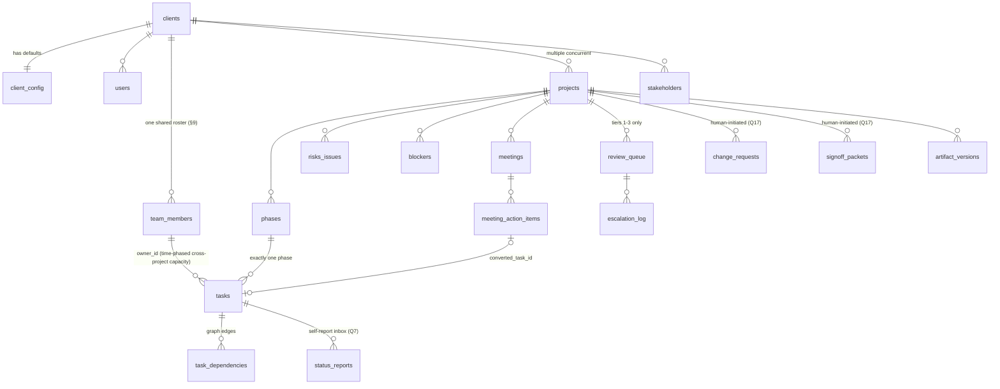

# NEXUS PM Agent — Database Schema (derived from PRD v5) — rev 2

Rev 2 incorporates the reviewed decisions on all 19 Open Questions (see
IMPLEMENTATION_PLAN.md §6 history). Changes from rev 1:

- **Q1 confirmed**: engine is **SQLite**, syntax unchanged.
- **Q3 corrected — allocation is time-phased, not total backlog**: `allocated_hrs`
  now means *concurrent weekly load*, and the recomputation query buckets task effort
  by planned-window overlap (see `team_members` below). The five follow-up questions
  this redesign raised (NEW-OQ 1–5) are now **all resolved** — decisions recorded
  inline as `[confirmed NEW-OQ n]`: uniform effort spread (1), working-day proration
  with holiday-prorated capacity (2), `allocated_hrs` = current-week display-only
  cache (3), refuse-and-flag on dateless tasks (4), ISO weeks Monday-start (5).
- **Q7 confirmed**: status self-reports arrive via a manual-entry inbox — added a
  `status_reports` table (not in PRD §12; addition confirmed in review).
- All previously-`[inferred]` enums, units, and structural choices are now **confirmed**;
  the inline markers below say `[confirmed]` where review resolved them.

Column-to-PRD traceability from rev 1 is retained. `JSON` columns are TEXT-with-JSON.

Single-client build (PRD §1): exactly one client row. `client_id` FKs are kept on
client-scoped tables so multi-tenant can be added later without redesign (PRD §14),
but no tenant isolation machinery is built.

---

## 1. Identity & Onboarding (implied by PRD §4 — not listed in §12; addition confirmed)

PRD §4 requires: our company creates the client company and its admin user; the admin
logs in, creates team members, creates projects. That flow needs `clients` and `users`.

**Q6 confirmed**: `users` (auth actors: reviewers, approvers, admins) stays separate from
`team_members` (assignable people) — a person can be either or both, optionally linked.

```sql
CREATE TABLE clients (
    client_id       INTEGER PRIMARY KEY,
    name            TEXT NOT NULL,
    created_at      TEXT NOT NULL DEFAULT (datetime('now'))
);
-- exactly one row in v1 (PRD §1)

CREATE TABLE users (
    user_id         INTEGER PRIMARY KEY,
    client_id       INTEGER NOT NULL REFERENCES clients(client_id),
    email           TEXT NOT NULL UNIQUE,
    display_name    TEXT NOT NULL,
    role            TEXT NOT NULL CHECK (role IN ('platform_admin','client_admin','member')),  -- [confirmed]
    invite_status   TEXT NOT NULL DEFAULT 'invited'
                    CHECK (invite_status IN ('invited','active','disabled')),                  -- [confirmed] PRD §4 "send invite"
    created_at      TEXT NOT NULL DEFAULT (datetime('now'))
);
```

---

## 2. Configuration (PRD §5)

### client_config — client-level defaults

PRD §5 enumerates the fields directly. Modeled as **one row per client with typed
columns** (not key-value), so config validation (PRD §13: "config edits are validated
on every save") can be a schema check.

```sql
CREATE TABLE client_config (
    client_id                 INTEGER PRIMARY KEY REFERENCES clients(client_id),

    about_client              TEXT,                          -- §5 "about the client"
    project_definition        TEXT,                          -- §5 [confirmed Q11]: free text describing what counts as a
                                                             -- distinct "project" for this client; read by Task Breakdown
                                                             -- to calibrate phase-decomposition granularity.
    reporting_cadence         TEXT NOT NULL
                              CHECK (reporting_cadence IN ('daily','weekly','biweekly')),  -- [confirmed Q12] enum, not cron; drives Status Tracking (§8.4)
    comms_cadence             TEXT
                              CHECK (comms_cadence IN ('daily','weekly','biweekly')),      -- [confirmed Q12] drives Stakeholder Comms (§8.8)
    skill_depth               JSON NOT NULL,                 -- §5 "skill depth per skill": map skill_name -> depth setting.
                                                             -- NOTE: Stakeholder Comms never gets a fully-automatic depth (§8.8) — enforced in config validator.
    tools_channels            JSON,                          -- §5 "tools/channels" (informational in v1 — no integrations, Q7/Q15)
    primary_reviewer_id       INTEGER NOT NULL REFERENCES users(user_id),
    backup_reviewer_id        INTEGER REFERENCES users(user_id),      -- nullable: §16 covers "backup also unset"
    escalation_delay_hours    REAL NOT NULL,                 -- §5 [confirmed Q5]: unit is hours
    escalation_delay_by_tier  JSON,                          -- §5 v2-correction: optional per-tier override, e.g. {"1": 4, "2": 24, "3": 48} (hours)
    change_approver_id        INTEGER NOT NULL REFERENCES users(user_id),   -- Tier 3 change requests (§10)
    signoff_approver_id       INTEGER NOT NULL REFERENCES users(user_id),   -- Tier 3 sign-off packets (§10)
    voice_style               TEXT,                          -- §5, read by Stakeholder Comms (§8.8)
    working_calendar          JSON NOT NULL,                 -- §5/§8.2: workdays + holidays, e.g. {"workdays":[1..5],"holidays":["2026-08-15"],"hours_per_day":8}
    assignment_strategy       TEXT NOT NULL
                              CHECK (assignment_strategy IN ('best_skill_match','balanced_workload')),  -- §8.3 step 4
    slip_threshold_days       REAL NOT NULL,                 -- §5/§8.4/§8.6

    updated_at                TEXT NOT NULL DEFAULT (datetime('now'))
);
```

### projects — includes per-project config overrides

Resolution order at read time: **project override first, client default otherwise**
(PRD §5) — implemented as a single config-resolver function, never inline lookups.

```sql
CREATE TABLE projects (
    project_id        INTEGER PRIMARY KEY,
    client_id         INTEGER NOT NULL REFERENCES clients(client_id),
    name              TEXT NOT NULL,
    scope_summary     TEXT,                                  -- §8.1 reads projects.scope_summary
    scope_document    TEXT,                                  -- §4/§8.1 [confirmed Q15]: plain text for v1; file uploads are Upgrade-phase
    budget_total      REAL,                                  -- §8.1
    timeline_start    TEXT,                                  -- §8.1 (ISO dates)
    timeline_end      TEXT,
    status            TEXT NOT NULL DEFAULT 'active'
                      CHECK (status IN ('intake','active','paused','closed','archived')),   -- [confirmed Q10]
    paused_reason     TEXT,                                  -- §10: silence-escalation pause shows "a visible banner"
    config_overrides  JSON NOT NULL DEFAULT '{}',            -- §5: any project may override any client-level default
    created_at        TEXT NOT NULL DEFAULT (datetime('now'))
);
```

Override validation (PRD §16): a required key unset at *both* levels is a config defect —
the affected skill refuses to run for that project. Validator logic, not a DB constraint.

---

## 3. Core PM Data (PRD §6, §8, §9, §12)

### phases (PRD §6 — names the fields directly)

```sql
CREATE TABLE phases (
    phase_id        INTEGER PRIMARY KEY,
    project_id      INTEGER NOT NULL REFERENCES projects(project_id),
    name            TEXT NOT NULL,                           -- §8.1 step 2
    description     TEXT NOT NULL,                           -- §6: "own description"
    planned_start   TEXT NOT NULL,                           -- §6: "planned start/end"
    planned_end     TEXT NOT NULL,
    status          TEXT NOT NULL DEFAULT 'planned'
                    CHECK (status IN ('planned','in_progress','done','on_hold')),  -- [confirmed Q10]
    sequence_order  INTEGER NOT NULL,                        -- §6: "sequence order"
    needs_clarification TEXT,                                -- §8.1 step 3: ambiguity flagged, not guessed
    created_at      TEXT NOT NULL DEFAULT (datetime('now')),
    UNIQUE (project_id, sequence_order)
);
```

### tasks

```sql
CREATE TABLE tasks (
    task_id          INTEGER PRIMARY KEY,
    phase_id         INTEGER NOT NULL REFERENCES phases(phase_id),   -- §6: belongs to exactly one phase
    project_id       INTEGER NOT NULL REFERENCES projects(project_id), -- [confirmed Q14] denormalized for the cross-project capacity query
    title            TEXT NOT NULL,
    description      TEXT,
    effort_hours     REAL,                                   -- §8.1 "effort estimate", in hours. NULL = no confirmed
                                                             -- estimate (e.g. task converted from a meeting action item):
                                                             -- Scheduler and Assignment Engine refuse-and-flag (Tier 1),
                                                             -- same treatment as a NULL planned window (NEW-OQ 4 principle);
                                                             -- excluded from CPM and capacity math until estimated.
    skill_tags       JSON NOT NULL DEFAULT '[]',             -- §8.1; matched against team_members.skill_tags (§8.3 step 2)
    owner_id         INTEGER REFERENCES team_members(member_id),  -- §8.3 writes tasks.owner_id; NULL until assigned / if unassignable
    planned_start    TEXT,                                   -- §8.2 writes; NULL until Scheduler runs.
    planned_end      TEXT,                                   -- NOTE (time-phased capacity, Q3): the Assignment Engine requires
                                                             -- planned dates to exist before it can assign — a dateless task is
                                                             -- refused, flagged, and raised as a Tier 1 clarification item,
                                                             -- never assigned. [confirmed NEW-OQ 4]
    actual_start     TEXT,                                   -- §8.4 step 5
    actual_end       TEXT,
    status           TEXT NOT NULL DEFAULT 'todo'
                     CHECK (status IN ('todo','in_progress','blocked','done','cancelled')),  -- [confirmed Q4]
    percent_complete REAL CHECK (percent_complete BETWEEN 0 AND 100),  -- §8.4 step 3
    slack_days       REAL,                                   -- §8.2 step 6
    on_critical_path INTEGER NOT NULL DEFAULT 0,             -- §8.2 step 7; §8.3 step 1 sorts by it
    unassignable     INTEGER NOT NULL DEFAULT 0,             -- §8.3 step 5: flag instead of over-allocating
    needs_clarification TEXT,                                -- §8.1 step 3
    source_action_item_id INTEGER REFERENCES meeting_action_items(action_item_id),  -- §8.7 step 5
    created_at       TEXT NOT NULL DEFAULT (datetime('now'))
);

-- Supports the per-window capacity query (owner's tasks filtered by window overlap):
CREATE INDEX idx_tasks_owner_window ON tasks (owner_id, planned_start, planned_end);
```

### task_dependencies (normalized graph — §12 v2-correction)

```sql
CREATE TABLE task_dependencies (
    predecessor_task_id INTEGER NOT NULL REFERENCES tasks(task_id),
    successor_task_id   INTEGER NOT NULL REFERENCES tasks(task_id),
    PRIMARY KEY (predecessor_task_id, successor_task_id),
    CHECK (predecessor_task_id <> successor_task_id)
);
-- [confirmed Q8] Finish-to-Start only; no lag/lead in v1.
-- Cycle prevention is enforced in the Scheduler/Dependency Manager (topological sort fails loudly), not in SQL.
```

### team_members — **client-scoped, not project-scoped** (PRD §9) — TIME-PHASED ALLOCATION (Q3)

There is no `project_id` here and no per-project roster table (§9).

**Q3 correction (review decision):** allocation is **concurrent load per week**, not a
flat sum of all open-task effort. A person with a multi-week pipeline of small,
non-overlapping tasks is *not* "at capacity" — only overlapping planned windows in the
same week count against that week's `capacity_hrs`.

Consequences for this table:

- `capacity_hrs` = **weekly** hours, default 40 [confirmed Q2]. In a week containing a
  holiday, effective capacity for the comparison is **prorated down by the missing
  working day(s)** (e.g. 32 h in a 4-day week at 8 h/day) — same working-day basis as
  demand, so supply and demand are never compared on mismatched bases.
  [confirmed NEW-OQ 2]
- The single scalar `allocated_hrs` (the PRD names this exact column, §8.3 writes it)
  cannot hold a per-week load vector. Convention [confirmed NEW-OQ 3]: **`allocated_hrs`
  is a denormalized cache of the member's concurrent load for the *current* ISO week
  (Monday start, [confirmed NEW-OQ 5])**, refreshed on every Assignment Engine run. It
  exists to satisfy the PRD's named write target and for display; **no capacity decision
  ever reads it** — capacity checks always derive per-week load from `tasks` via
  `lib/allocation.py`, for every week the candidate task's window touches.

```sql
CREATE TABLE team_members (
    member_id        INTEGER PRIMARY KEY,
    client_id        INTEGER NOT NULL REFERENCES clients(client_id),  -- §9: one shared roster per client
    user_id          INTEGER REFERENCES users(user_id),      -- [confirmed Q6] optional link if the member also has a login
    name             TEXT NOT NULL,
    role             TEXT NOT NULL,                          -- §4 step 2
    skill_tags       JSON NOT NULL DEFAULT '[]',
    capacity_hrs     REAL NOT NULL DEFAULT 40,               -- [confirmed Q2] weekly capacity, default 40
    allocated_hrs    REAL NOT NULL DEFAULT 0,                -- §8.3/§9 named column — CACHE of current-week concurrent load
                                                             -- across every active project. Never authoritative; see query below. [NEW-OQ 3]
    is_active        INTEGER NOT NULL DEFAULT 1              -- §8.3 step 2 "marked active"
);
```

**Capacity invariant (PRD §15, time-phased form):** for every member and every week `w`,
`concurrent_load(member, w) <= capacity_hrs`. Enforced by the Assignment Engine (it
checks every week the candidate task's window touches before assigning, and refuses +
flags rather than over-allocating) and verified in tests by recomputation:

Proration rules [confirmed NEW-OQ 1, NEW-OQ 2]: effort is spread **uniformly** across
the task's planned window, counted in **working days** per `working_calendar` (weekends
and holidays contribute no effort). Because working-day math needs the calendar JSON,
the **authoritative implementation lives in `lib/allocation.py`**; the SQL below uses
calendar-day proration and serves as an approximate cross-check in tests, not a
decision path.

```sql
-- TEST-TIME VERIFIER (approximate: calendar-day proration; lib/allocation.py's
-- working-day version is authoritative for all capacity decisions).
-- Concurrent load for one member over a target window [:win_start, :win_end]:
-- each open task on an ACTIVE project contributes effort prorated by how much of its
-- planned window overlaps the target window, spread uniformly.
SELECT t.owner_id,
       SUM(
         t.effort_hours *
         ( (JULIANDAY(MIN(t.planned_end, :win_end)) - JULIANDAY(MAX(t.planned_start, :win_start)) + 1)
           / (JULIANDAY(t.planned_end) - JULIANDAY(t.planned_start) + 1) )
       ) AS concurrent_load_hrs
FROM tasks t
JOIN projects p ON p.project_id = t.project_id AND p.status = 'active'
WHERE t.owner_id = :member_id
  AND t.status NOT IN ('done','cancelled')
  AND t.planned_start <= :win_end      -- window overlap predicate
  AND t.planned_end   >= :win_start
GROUP BY t.owner_id;
```

The old rev-1 flat sum (`SUM(effort_hours)` unconditioned on dates) is retired — it made
anyone with a normal multi-week pipeline look permanently at capacity.

**FF-1 — remaining-effort weighting (IMPLEMENTED, Phase 1):** an open task contributes
`effort_hours × (1 − COALESCE(percent_complete, 0)/100)` to load, per `lib/allocation.py`
(`remaining_effort()`). NULL `percent_complete` counts as 0% complete — no signal means
nothing is confirmed done (full effort, the conservative direction). A task reported 100%
but not yet statused `done` contributes nothing. Covered by dedicated tests in
`tests/test_allocation.py` (NULL, partial, 100%-not-done, capacity-frees-as-work-completes).

### status_reports — self-report inbox (added per Q7; not in PRD §12)

**Q7 confirmed:** no channel integration in v1. Status replies (§8.4 steps 1–2) land here
by manual entry; Status Tracking consumes unprocessed rows on its cadence.

```sql
CREATE TABLE status_reports (
    report_id       INTEGER PRIMARY KEY,
    task_id         INTEGER NOT NULL REFERENCES tasks(task_id),
    member_id       INTEGER NOT NULL REFERENCES team_members(member_id),  -- who is reporting
    raw_text        TEXT NOT NULL,                           -- §8.4 step 2: the free-text reply
    parsed_status   TEXT CHECK (parsed_status IN ('todo','in_progress','blocked','done','cancelled')),  -- §8.4 step 3, NULL until parsed
    parsed_percent_complete REAL CHECK (parsed_percent_complete BETWEEN 0 AND 100),
    is_ambiguous    INTEGER NOT NULL DEFAULT 0,              -- §8.4 step 4: flagged rather than guessed
    received_at     TEXT NOT NULL DEFAULT (datetime('now')),
    processed_at    TEXT                                     -- NULL = not yet consumed by Status Tracking
);
```

### risks_issues (PRD §8.5)

```sql
CREATE TABLE risks_issues (
    risk_id        INTEGER PRIMARY KEY,
    project_id     INTEGER NOT NULL REFERENCES projects(project_id),
    kind           TEXT NOT NULL CHECK (kind IN ('risk','issue')),   -- [confirmed Q9] label only, no behavioral difference in v1
    title          TEXT NOT NULL,
    description    TEXT,
    severity       INTEGER NOT NULL CHECK (severity BETWEEN 1 AND 5),    -- §8.5 step 4
    likelihood     INTEGER NOT NULL CHECK (likelihood BETWEEN 1 AND 5),  -- §8.5 step 4
    score          INTEGER GENERATED ALWAYS AS (severity * likelihood),  -- §8.5: severity × likelihood
    status         TEXT NOT NULL DEFAULT 'open'
                   CHECK (status IN ('open','mitigating','closed')),     -- [confirmed Q10]
    source         TEXT NOT NULL CHECK (source IN ('rule_based','pattern_detected')),  -- §8.5 step 5, exact PRD values
    related_task_id INTEGER REFERENCES tasks(task_id),
    created_at     TEXT NOT NULL DEFAULT (datetime('now')),
    updated_at     TEXT NOT NULL DEFAULT (datetime('now'))
);
```

### blockers (PRD §8.7 step 6, §9 bullet)

```sql
CREATE TABLE blockers (
    blocker_id    INTEGER PRIMARY KEY,
    project_id    INTEGER NOT NULL REFERENCES projects(project_id),
    description   TEXT NOT NULL,
    raised_by     INTEGER REFERENCES team_members(member_id),      -- §9: who raised it...
    assigned_to   INTEGER REFERENCES team_members(member_id),      -- §9: ...distinct from who resolves it; NULL + reviewer flag if unclear (§8.7 step 6)
    blocked_member_id INTEGER REFERENCES team_members(member_id),  -- §8.7 step 2: "who's blocked"
    task_id       INTEGER REFERENCES tasks(task_id),               -- "on what", when it maps to a task
    meeting_id    INTEGER REFERENCES meetings(meeting_id),         -- provenance when raised via Meeting Summary
    status        TEXT NOT NULL DEFAULT 'open'
                  CHECK (status IN ('open','resolved')),           -- [confirmed Q10]
    created_at    TEXT NOT NULL DEFAULT (datetime('now')),
    resolved_at   TEXT
);
```

### meetings & meeting_action_items (PRD §8.7)

**Q19 confirmed:** uploads are per-project — `project_id` supplied at upload; multi-project
transcripts are out of scope for v1 (upload separately per project).

```sql
CREATE TABLE meetings (
    meeting_id    INTEGER PRIMARY KEY,
    project_id    INTEGER NOT NULL REFERENCES projects(project_id),  -- [confirmed Q19]
    meeting_date  TEXT,
    raw_transcript TEXT NOT NULL,                            -- §8.7 step 1
    decisions     JSON NOT NULL DEFAULT '[]',                -- §8.7 step 4: [{"decision":..., "decided_by":...}]
    uploaded_by   INTEGER REFERENCES users(user_id),         -- §8.7 trigger
    created_at    TEXT NOT NULL DEFAULT (datetime('now'))
);

CREATE TABLE meeting_action_items (
    action_item_id    INTEGER PRIMARY KEY,
    meeting_id        INTEGER NOT NULL REFERENCES meetings(meeting_id),
    description       TEXT NOT NULL,
    owner_id          INTEGER REFERENCES team_members(member_id),  -- §8.7: "owner ... if stated" → nullable
    due_date          TEXT,                                        -- "due date if stated" → nullable
    converted_task_id INTEGER REFERENCES tasks(task_id),           -- §8.7 step 5, exact PRD field name
    status            TEXT NOT NULL DEFAULT 'open'
                      CHECK (status IN ('open','done','converted')),  -- [confirmed Q10]
    created_at        TEXT NOT NULL DEFAULT (datetime('now'))
);
```

### stakeholders (PRD §8.8)

```sql
CREATE TABLE stakeholders (
    stakeholder_id INTEGER PRIMARY KEY,
    client_id      INTEGER NOT NULL REFERENCES clients(client_id),
    project_id     INTEGER REFERENCES projects(project_id),  -- [confirmed Q13] nullable: client-wide stakeholders allowed
    name           TEXT NOT NULL,
    email          TEXT,
    audience_type  TEXT NOT NULL
                   CHECK (audience_type IN ('team','exec','client','investor'))  -- §8.8 step 2, exact PRD values
);
```

### change_requests & signoff_packets (PRD §12; Tier 3 per §10)

**Q17 confirmed:** in v1 these are **reviewer/admin-initiated only, via a basic form** —
no skill auto-creates them. A skill detecting a scope/timeline/budget conflict raises its
normal Tier 1 alert (e.g. the Scheduler's infeasible-plan flag) and stops there;
auto-escalation from alert to formal Tier 3 change request is Upgrade-phase.

```sql
CREATE TABLE change_requests (
    change_request_id INTEGER PRIMARY KEY,
    project_id     INTEGER NOT NULL REFERENCES projects(project_id),
    title          TEXT NOT NULL,
    description    TEXT,
    requested_by   INTEGER NOT NULL REFERENCES users(user_id),   -- [confirmed Q17] always a human in v1
    status         TEXT NOT NULL DEFAULT 'draft'
                   CHECK (status IN ('draft','pending_approval','approved','rejected')),  -- [confirmed Q10]
    review_item_id INTEGER REFERENCES review_queue(item_id), -- the Tier 3 gate
    created_at     TEXT NOT NULL DEFAULT (datetime('now'))
);

CREATE TABLE signoff_packets (
    packet_id      INTEGER PRIMARY KEY,
    project_id     INTEGER NOT NULL REFERENCES projects(project_id),
    title          TEXT NOT NULL,
    content        TEXT,                                     -- §10 "formal packet, explicit sign-off"
    status         TEXT NOT NULL DEFAULT 'draft'
                   CHECK (status IN ('draft','pending_signoff','signed_off','rejected')), -- [confirmed Q10]
    review_item_id INTEGER REFERENCES review_queue(item_id),
    created_at     TEXT NOT NULL DEFAULT (datetime('now'))
);
```

---

## 4. Governance & Audit (PRD §10, §13)

### review_queue — the tier gate (unchanged from rev 1; confirmed in review)

Structural enforcement of "nothing auto-approved at Tier ≥ 1":

1. Only tiers 1–3 exist in the queue. Tier 0 actions never create a queue item — they go
   straight to `audit_log`.
2. A row can only reach `approved`/`rejected` with a non-null human `resolved_by` — CHECK-enforced.
3. No `auto_approved` status value exists in the CHECK enum at all.

```sql
CREATE TABLE review_queue (
    item_id        INTEGER PRIMARY KEY,
    project_id     INTEGER NOT NULL REFERENCES projects(project_id),
    tier           INTEGER NOT NULL CHECK (tier IN (1, 2, 3)),   -- §10; tier 0 never enters the queue
    item_type      TEXT NOT NULL CHECK (item_type IN (
                       'risk_alert',          -- §8.5 step 6 (Tier 1)
                       'off_track_alert',     -- §8.4 step 8 (Tier 1)
                       'infeasible_plan',     -- §8.2 step 9 (Tier 1)
                       'unassignable_task',   -- §8.3 step 5 (Tier 1)
                       'slip_impact',         -- §8.6 step 6 (Tier 1)
                       'clarification',       -- §8.1 steps 3–4, §8.7 step 6 (Tier 1)
                       'comms_draft',         -- §8.8 step 4 (Tier 2)
                       'status_report',       -- §10 example (Tier 2)
                       'retrospective',       -- §11 close path (Tier 2, confirmed Q18)
                       'change_request',      -- §10 (Tier 3)
                       'signoff_packet'       -- §10 (Tier 3)
                   )),
    payload        JSON NOT NULL,
    created_by_skill TEXT NOT NULL,
    status         TEXT NOT NULL DEFAULT 'pending'
                   CHECK (status IN ('pending','approved','rejected','escalated','paused')),
    resolved_by    INTEGER REFERENCES users(user_id),
    resolved_at    TEXT,
    reviewer_notes TEXT,
    created_at     TEXT NOT NULL DEFAULT (datetime('now')),

    -- approval/rejection REQUIRES a human: no code path can set approved without a user id
    CHECK (status NOT IN ('approved','rejected') OR resolved_by IS NOT NULL)
);
```

Tier is **fixed by the producing skill** (§10) — the tier-per-item_type mapping lives in
code as a frozen constant, not in config.

### escalation_log (PRD §10, §13)

```sql
CREATE TABLE escalation_log (
    escalation_id  INTEGER PRIMARY KEY,
    item_id        INTEGER NOT NULL REFERENCES review_queue(item_id),
    stage          TEXT NOT NULL CHECK (stage IN ('primary_notified','backup_notified','work_paused')),  -- §10 ladder
    reason         TEXT NOT NULL,                            -- §13: "timestamp, reason, and outcome"
    outcome        TEXT,
    occurred_at    TEXT NOT NULL DEFAULT (datetime('now'))
);
```

### artifact_versions (PRD §13; §8.8 step 7; retrospective per Q18)

```sql
CREATE TABLE artifact_versions (
    version_id     INTEGER PRIMARY KEY,
    project_id     INTEGER NOT NULL REFERENCES projects(project_id),
    artifact_type  TEXT NOT NULL CHECK (artifact_type IN
                       ('status_report','risk_register','signoff_packet','comms_message','retrospective')),  -- [confirmed Q18]
    artifact_ref   INTEGER,                                  -- id in the source table, where applicable
    version_number INTEGER NOT NULL,
    content        TEXT NOT NULL,                            -- §8.8: "version the final approved text"
    created_by     INTEGER REFERENCES users(user_id),
    created_at     TEXT NOT NULL DEFAULT (datetime('now')),
    UNIQUE (artifact_type, artifact_ref, version_number)
);
```

### audit_log (PRD §13)

```sql
CREATE TABLE audit_log (
    audit_id       INTEGER PRIMARY KEY,
    project_id     INTEGER REFERENCES projects(project_id),  -- nullable: some actions (config edit) are client-level
    skill          TEXT NOT NULL,                            -- one of the 8 skills, or 'config','governance','orchestrator'
    action         TEXT NOT NULL,
    input_summary  JSON,                                     -- [confirmed Q16] JSON summaries + artifact references, not full bodies
    output_summary JSON,
    actor          TEXT NOT NULL DEFAULT 'agent',            -- 'agent' or a user_id string
    occurred_at    TEXT NOT NULL DEFAULT (datetime('now'))
);
```

---

## 5. Relationship Summary



Key structural decisions (all traced to the PRD; confirmed in review):

- **team_members hangs off clients, never projects** (§9).
- **Capacity is time-phased (Q3)**: checks compare per-week concurrent load — derived
  from task planned windows across every active project — against weekly `capacity_hrs`.
  The scalar `allocated_hrs` is a display cache only, never a decision input.
- **config_overrides is a JSON column on projects**, resolved by one shared resolver.
- **review_queue cannot represent an auto-approved Tier 1–3 item.**
- **task_dependencies is a real edge table**, shared by Scheduler and Dependency Manager.
- **status_reports** is the manual-entry inbox standing in for channel integrations (Q7).
