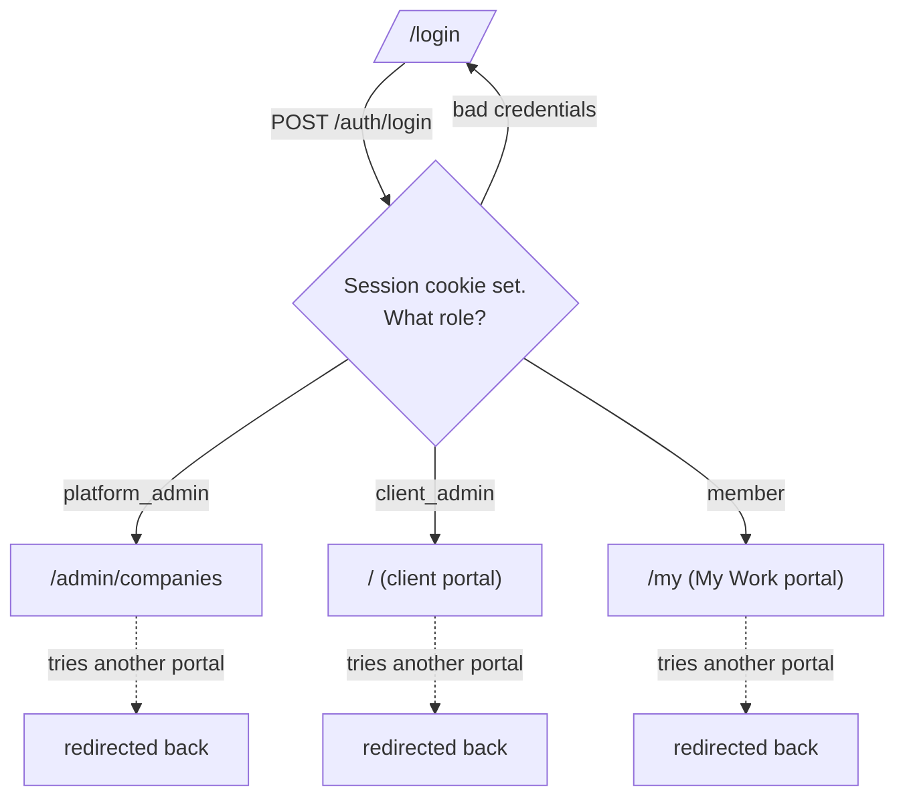
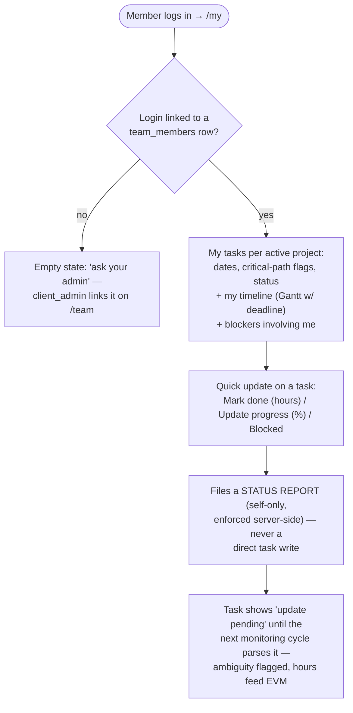
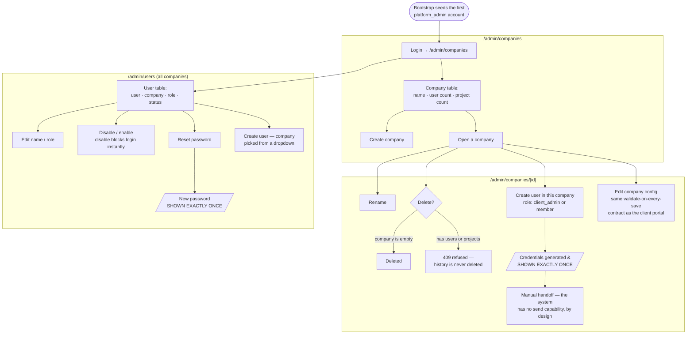
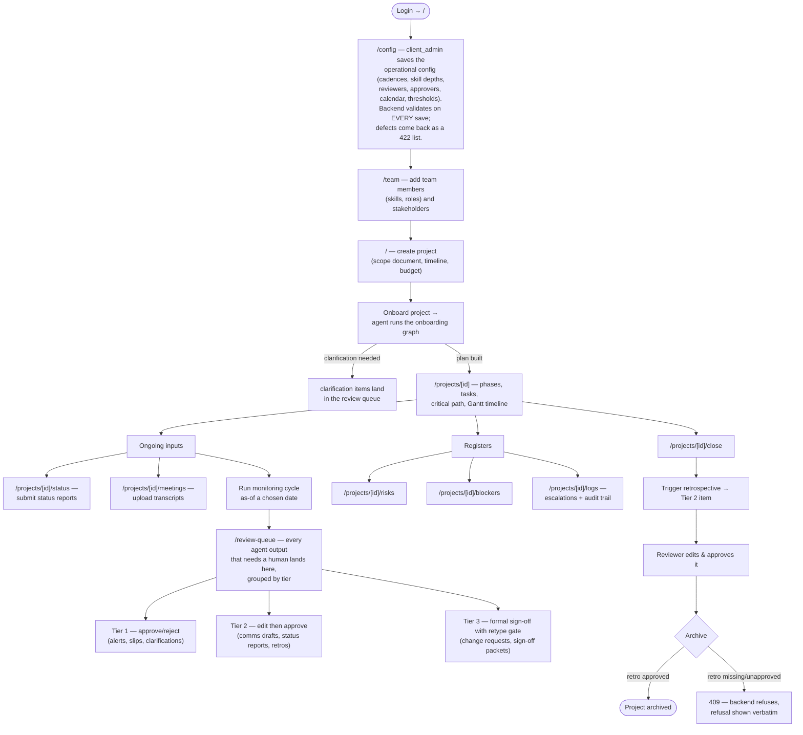
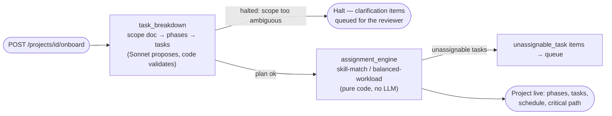
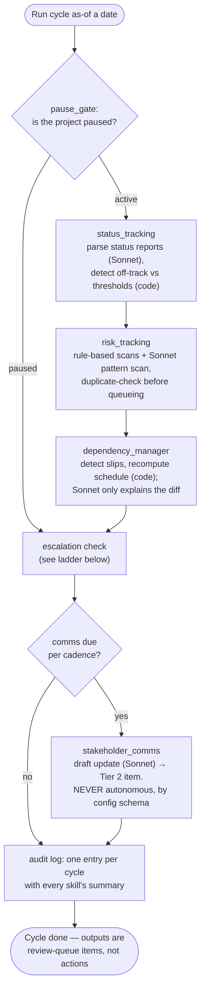
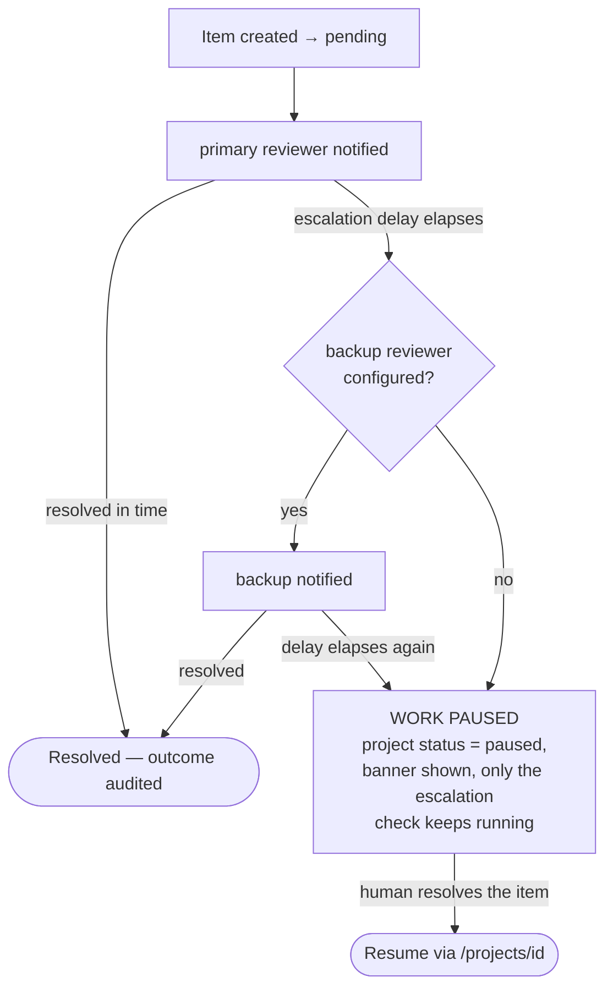
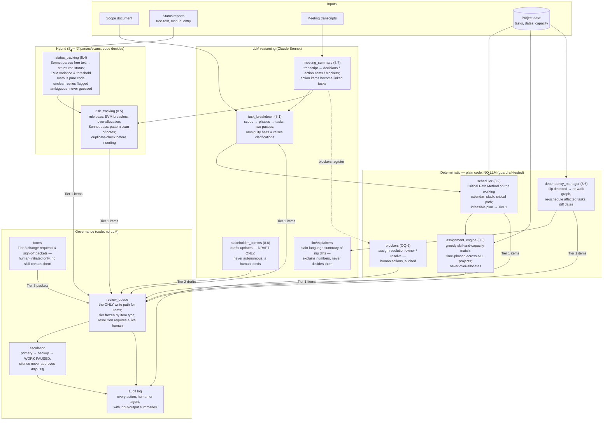

# NEXUS PM Agent — Portal User Flows & Agent Flowcharts

This document maps (1) the user flows through the two portals built on top of
the FastAPI backend, and (2) how the agent — the orchestrated skill graph in
`src/` — actually runs. Sources of truth: `api/` routes, `frontend/src/app/`
pages, `src/orchestrator/graph.py`, `src/governance/`.

---

## 1. Roles & entry

Three roles, one login page, three mutually exclusive portals:

| Role | Portal | Can do |
|---|---|---|
| `platform_admin` | **Admin portal** (`/admin/*`) | Manage companies, users, and any company's config. No access to client project data (API returns 403). |
| `client_admin` | **Client portal** (`/`) | Everything: config, projects, team (incl. linking logins to roster rows), review queue, registers, close path. |
| `member` | **My Work portal** (`/my`) | Their own tasks/timelines/blockers (via the `team_members.user_id` login link) and self-only status updates. No management surface — every other endpoint returns 403. |

### 1b. My Work portal (`member`) — flow

Notes:
- First successful login flips a user from `invited` → `active`.
- A `disabled` user's session is rejected at the API (401) — the admin
  disable action takes effect immediately.
- The Next.js middleware only checks cookie presence; **the API is the real
  permission boundary** (`require_role` on every endpoint).

---

## 2. Admin portal user flow (`platform_admin`)

The platform admin's job is onboarding: create the company, create its users,
hand credentials over manually, optionally pre-fill the company's config.

Guarantees enforced by the backend (and tested):
- Plaintext passwords exist **only** in the one HTTP response — never stored,
  never audited, never sent anywhere.
- `platform_admin` accounts cannot be created, edited, or reset through the
  portal — bootstrap only.
- Users are never hard-deleted; companies only while empty. Audit history
  survives everything.

---

## 3. Client portal user flow (`client_admin` / `member`)

The full loop from an empty account to an archived project:

Deliberate UX properties: no auto-polling (manual Refresh keeps cause→effect
visible), no optimistic UI (every render is post-mutation truth from SQLite),
no batch approve (each item is resolved individually).

---

## 4. How the agent works

"The agent" is not one loop — it is two LangGraph state graphs over
deterministic skills, with Sonnet used only where language understanding is
required (extraction, explanation, drafting). **Sonnet never decides dates,
assignments, or approvals** — those are code (`src/lib/` scheduling, EVM,
task-graph math) or humans (the review queue).

### 4.1 Onboarding graph — runs once per project

### 4.2 Monitoring cycle — runs on demand (or per cadence)

Key invariant: **when a project is paused, nothing runs except the
escalation check** — the agent never quietly keeps working on paused work.

### 4.3 Governance: tiers and the escalation ladder

Every skill output that needs a human becomes a `review_queue` item. The
item's tier is **frozen to its type** (not configurable — the one deliberate
exception to config-not-code):

| Tier | Resolution | Item types |
|---|---|---|
| 1 | Approve / reject | `risk_alert`, `off_track_alert`, `infeasible_plan`, `unassignable_task`, `slip_impact`, `clarification` |
| 2 | Edit, then approve | `comms_draft`, `status_report`, `retrospective` |
| 3 | Formal packet + explicit sign-off | `change_request`, `signoff_packet` |

Unresolved items climb a ladder; the terminal state is a **paused project**,
never a silent auto-approval:

### 4.4 Agent catalog — every skill and what it does

All nine skills plus the governance layer, grouped by what kind of "brain"
each one has. Solid arrows are data flow; every human-facing output funnels
through the review queue — no skill acts on its own output.

| Agent / module | PRD § | Brain | Functionality | Raises |
|---|---|---|---|---|
| `task_breakdown` | 8.1 | Sonnet | Scope → phases, then phase → tasks (strictly two passes). Validation failure or model refusal **halts** — nothing silently patched. | Tier 1 `clarification`, halt |
| `scheduler` | 8.2 | Code | Critical Path Method in working-day math on the client calendar; writes planned dates, slack, critical path. | Tier 1 `infeasible_plan` |
| `assignment_engine` | 8.3 | Code | Greedy skills+capacity match, time-phased and cross-project; refuses tasks with no window or no qualifying candidate. | Tier 1 `unassignable_task` |
| `status_tracking` | 8.4 | Hybrid | Sonnet parses free-text reports into structured status; EVM variance vs thresholds is pure code. | Tier 1 `off_track_alert`, ambiguous flags |
| `risk_tracking` | 8.5 | Hybrid | Rule pass (EVM breach, over-allocation) + Sonnet pattern scan of meeting/status text; dedup before insert. | Tier 1 `risk_alert` |
| `dependency_manager` | 8.6 | Code | On a slip: re-walk the dependency graph, re-run scheduling for affected tasks, diff the dates. Sonnet only *explains* the diff (`explainers`). | Tier 1 `slip_impact` |
| `meeting_summary` | 8.7 | Sonnet | Transcript → decisions, action items, blockers; work-implying action items become linked tasks (effort left NULL for a human). | Register rows, downstream flags |
| `stakeholder_comms` | 8.8 | Sonnet | Drafts stakeholder updates per cadence/voice config. Draft-only: no send capability exists in the codebase. | Tier 2 `comms_draft` |
| `blockers` | OQ-6 | Code | Assign a resolution owner / resolve a blocker — human actions taken from the queue, audited with a real actor. | — |
| `governance/review_queue` | 10 | Code | Sole write path for review items; tier frozen by type; only a human resolves. | — |
| `governance/escalation` | 10, 16 | Code | Silence ladder: primary → backup → pause project. Never auto-approves. | `escalation_log`, pause |
| `governance/forms` | 10 | Code | Change requests & sign-off packets, human-initiated only. | Tier 3 items |

Cross-cutting rules the flowcharts rely on:
- **Everything is audited** (`audit_log`): who did it, input and output
  summaries — including every admin-portal action, with the human as actor.
- **No outbound send exists anywhere** — enforced by an import allowlist and
  tests; "sending" a comms draft means a human copies the approved text.
- **Skill depth** (`manual` / `assisted` / `autonomous`) is per-skill config,
  except `stakeholder_comms`, which can never be `autonomous`.
